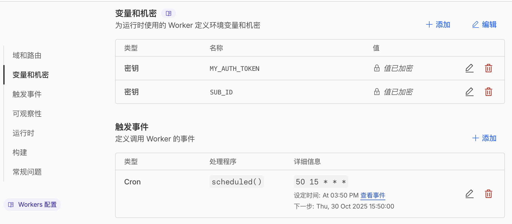

# 前言
目前看其他人的版本都配置了一个复杂的后台或者有其他更为灵活但是也更复杂的功能，而我只需要一个自动重置的功能即可，因此完成了这个 worker，你可以直接在 cf 中新建 worker，然后对环境变量和定时任务进行配置，就能够自动在对应时间刷新订阅。

# 88code 订阅额度自动重置工具

自动重置 88code 订阅额度的 Cloudflare Worker，支持定时任务和手动触发。

## 功能特性

- 定时自动重置订阅额度
- 支持手动触发重置
- 错误处理和日志记录
- 环境变量安全配置

## 部署步骤

### 1. 创建 Cloudflare Worker

1. 登录 [Cloudflare Dashboard](https://dash.cloudflare.com/)
2. 选择 Workers & Pages
3. 创建新的 Worker
4. 复制 `worker.js` 的内容到 Worker 编辑器

### 2. 配置环境变量

在 Worker 设置页面，点击左侧菜单的「变量和机密」，添加以下 Secret 类型的环境变量：

- `MY_AUTH_TOKEN`: 88code 授权 Token（类型选择「密钥」）
- `SUB_ID`: 订阅 ID（类型选择「密钥」）



### 3. 配置 Cron Trigger

在 Worker 设置页面，点击左侧菜单的「触发事件」，添加 Cron 触发器：

示例配置：`50 15 * * *`（北京时间每天 23:50 执行）

> 注意需要 -8 小时，因为 CF 的时间是 UTC+0


常用 Cron 表达式：
- `50 15 * * *` - 北京时间每天 23:50（UTC 15:50）
- `0 0 * * *` - 北京时间每天 08:00（UTC 00:00）
- `0 */12 * * *` - 每 12 小时执行一次

**注意**：Cloudflare Cron 使用 UTC 时间，北京时间需要减去 8 小时。例如北京时间 23:50 对应 UTC 15:50。

## 使用方法

### 自动执行

配置 Cron Trigger 后，Worker 会按照设定的时间自动执行重置操作。

### 手动触发

向 Worker URL 发送 POST 请求：

```bash
curl -X POST https://your-worker.workers.dev/manual-reset
```

成功响应：

```json
{
  "status": "success",
  "message": "Credits manually reset successfully."
}
```

### 检查状态

访问 Worker URL：

```bash
curl https://your-worker.workers.dev
```

## 日志查看

在 Cloudflare Dashboard 的 Worker 页面，选择 "Logs" 标签查看执行日志。

## API 接口

### POST /manual-reset

手动触发额度重置。

**响应示例**

成功：
```json
{
  "status": "success",
  "message": "Credits manually reset successfully."
}
```

失败：
```json
{
  "status": "error",
  "message": "Manual reset failed: [error details]"
}
```

### GET /

检查 Worker 运行状态。

**响应**

```
Subscription Reset Worker is active. Scheduled handler is configured. Use /manual-reset POST to trigger manually.
```

## 故障排查

1. **环境变量未设置**
   - 检查 `MY_AUTH_TOKEN` 和 `SUB_ID` 是否已配置
   - 确认环境变量类型为 Secret（加密存储）

2. **API 调用失败**
   - 查看 Worker 日志中的错误信息
   - 验证 Token 是否有效
   - 确认订阅 ID 正确

3. **定时任务未执行**
   - 检查 Cron Trigger 配置是否正确
   - 查看 Worker 的 Metrics 确认触发次数

## 技术栈

- Cloudflare Workers
- Cron Triggers

## 许可证

MIT